# Somatic

Somatic is a consent-gated, local-first, **informational** personal-health engine. You run it on your machine. Nothing leaves this machine unless you opt into a public literature query or a model you already host. It is never diagnosis, prescription, or dosing.

**Status:** local v1. Informational, not medical. Research runs on an offline fixture corpus by default.

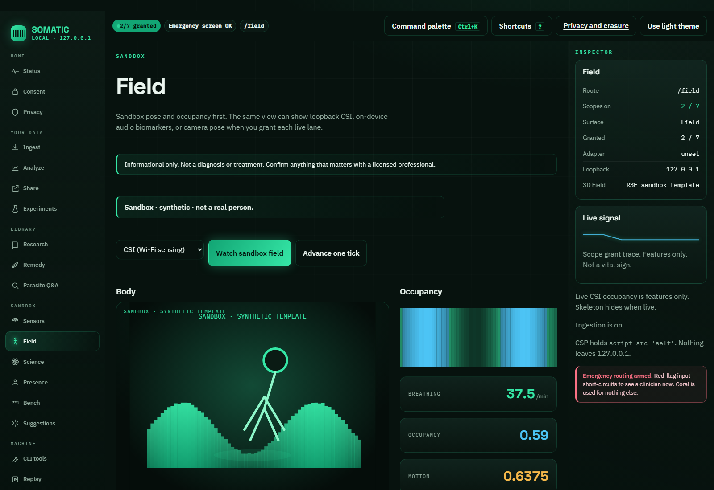

**Local UI — Field (dark, default):** the glowing 3D stage on `127.0.0.1`. Sandbox / synthetic pose and occupancy, not a body scan. Live hardware is founder-gated. All other scopes still start **OFF**.

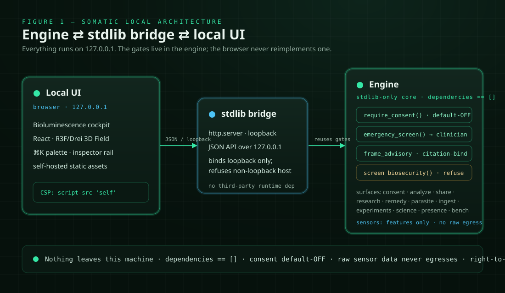

**Figure 1 — Somatic local architecture:** Bioluminescence cockpit ↔ stdlib loopback bridge ↔ engine; consent / emergency / citation / biosecurity gates sit on every path. Source: [docs/diagrams/somatic-local-architecture.svg](docs/diagrams/somatic-local-architecture.svg) (authored SVG). Simplified [draw.io](docs/diagrams/somatic-local-architecture.drawio) and [Mermaid](docs/diagrams/somatic-local-architecture.mmd) alternates describe the same three nodes.

## 🎛️ What it is

Somatic is a **stdlib-only Python** package plus a designed local graphical app: the **Bioluminescence** cockpit (dark, luminous, data-dense; light is a sibling). There is no Somatic cloud, no account, and no runtime pip install for the core (`pyproject.toml` `[project].dependencies` is `[]`). The CLI is `python -m somatic`. The UI is `python -m somatic ui` on **127.0.0.1**.

Runtime is organized by package, not by a hosted service map:

- `somatic/consent/` — seven granular scopes, all default **OFF**, plus a local ledger and right-to-erasure.
- `somatic/safety/` — `require_consent`, `emergency_screen`, `frame_advisory`, evidence grades.
- `somatic/advisory/` — optional OpenAI-compatible informational adapter (bring-your-own model; off until configured).
- `somatic/insights/` — deviation vs the user's own baseline and/or caller-supplied ranges. **No hardcoded medical normals.**
- `somatic/flows/` — `analyze` and `share` end-to-end paths.
- `somatic/research/` — citation-bound lookup over the offline corpus; optional live Europe PMC behind `SOMATIC_RESEARCH_LIVE`.
- `somatic/remedy/` — evidence-graded informational library (default grade `none`, cap `limited`).
- `somatic/parasite/` — informational Q&A; does **not** identify a species.
- `somatic/ingest/` — CSV and Apple Health quantity-record import into a timestamped packet.
- `somatic/experiments/` — n-of-1 tags vs the user's own series.
- `somatic/sensors/` — sandbox roster; features only; loopback CSI ingest off by default.
- `somatic/evidence_bus/` — sandbox Evidence Bus over simulated modalities.
- `somatic/science/` — sandbox science harness plus a public-name biosecurity refuse-list.
- `somatic/presence/` — Scientist/Doctor restatement, **render-only**.
- `somatic/bench/` — sandbox scoring on a fixture task (not a lab reproduction).
- `somatic/bridge/` — stdlib HTTP server on `127.0.0.1` that reuses the same engine functions as the CLI.
- `ui/` — Vite + React **authoring** package. End users do not run it. Production assets live in `somatic/bridge/static/`.
- `somatic/cli/` — `python -m somatic {ui,doctor,analyze,share,consent,…}`.

Pre-pivot mock-run / Fabric / Phase 11–12 surfaces still exist in the tree. They are provenance, not the product pitch. See [docs/HISTORY.md](docs/HISTORY.md) and [docs/ARCHITECTURE.md](docs/ARCHITECTURE.md).

## 🧠 Why it matters

For a person tracking their own signals: analysis is against **your** baseline or ranges **you** supplied. Seven capabilities stay off until you grant them. Erasure is one action.

For a clinician receiving a share: `share` produces a local Markdown summary of an analyze report. It does not upload. It does not diagnose. Provenance and evidence grades travel with the text.

For a privacy-first user: the UI binds loopback only. There is no telemetry, no CDN, and no account. Optional live literature sends the **question string** to a public API, never sensor payloads. Optional AI advisory talks only to a model URL you set.

## 🚦 Status

Honest split, the same kind of stub-vs-real mix the sister repo documents:

- **Real** — consent spine (seven scopes, default OFF); `require_consent` / `emergency_screen` / `frame_advisory` (English + Spanish + French lexicons); `analyze` and `share`; citation-bound research over the **offline fixture corpus**; local **Bioluminescence** UI on `127.0.0.1` (⌘K palette, inspector rail, R3F Field); guarded live sensor lanes for CSI / audio / camera pose (each default-OFF, subject consent required).
- **Sandbox by default** — every sensor lane simulates unless you grant its live lane (`LIVE_SENSOR_INTEGRATION_IMPLEMENTED` stays `False`; features only); Evidence Bus; science harness; presence (text restatement, no TTS / talking-head / camera / mic).
- **Off by default** — live literature (`SOMATIC_RESEARCH_LIVE`); AI advisory (bring-your-own `SOMATIC_ADVISORY_MODEL_*`); encryption at rest (`SOMATIC_ENCRYPT_STORES`).
- **Founder-gated** — LICENSE, public release / website, buying + validating real hardware (ESP32, camera), the CSI pose model weights.

Usable locally. Not a medical device. Not a hosted product.

## ✨ Features

### Consent & safety spine

- Seven scopes: `data-ingestion`, `analysis-insight`, `ai-advisory`, `autonomous-research`, `proactive-suggestions`, `professional-sharing`, `remedy-library`. All default OFF.
- Fail-closed `require_consent`. Invalid or missing ledger loads as all-OFF.
- `emergency_screen` routes red-flag input to "see a clinician now." Self-harm language routes to the locale-appropriate crisis line: US **988** default (press 2 for Spanish), Spain **024**, France **3114**. Lexicons cover English, Spanish, and French; other languages remain a stated gap, not a silent pass.
- `frame_advisory` refuses diagnosis / prescription / dosing wording. Engine text is shown as returned; the UI does not rewrite it.
- Evidence grades: `strong`, `moderate`, `limited`, `preliminary`, `none`.

### Analyze & share

- `python -m somatic analyze --data <packet.json>` — informational insights on a user-owned packet.
- Optional `--baselines` (own series) and `--references` (caller-supplied ranges). No population normals baked in.
- `python -m somatic share --data <packet.json>` — clinician-facing Markdown, local only.
- Optional `--fhir-out` writes a FHIR-*shaped* JSON sidecar for portability. That is not a claim of FHIR R4 conformance.
- `--grant` on these commands is a **session overlay**. It does not write the consent store.

### Research / Remedy / Parasite

- Offline BM25 retrieval plus citation-binding. Unbound claims are dropped.
- Honest-null when nothing binds: `No evidence available; consult a professional.`
- Default research path is the bundled fixture corpus, not PubMed.
- Optional live lookup is Europe PMC (https, host-allowlisted, no redirects, question string only). Off unless `SOMATIC_RESEARCH_LIVE` is `1` / `true` / `yes` / `on`. CI never hits the network.
- Remedy library is informational; default grade `none`, cap `limited`; not a prescription.
- Parasite path is Q&A, not species identification.

### N-of-1 experiments

- Tag an intervention against the user's own ingested series.
- Directional own-baseline math only. Not a clinical cutoff.

### Ingestion (CSV / Apple Health)

- Consent-gated CSV and Apple Health import into a timestamped `somatic.packet.v1`.
- Apple Health keeps numeric `HKQuantityTypeIdentifier` Records only (category types such as sleep analysis are skipped; NaN / inf rejected). Mixed units for one metric are noted, not converted.

### Sensor lanes (sandbox by default, features-only)

- Roster covers CSI, video, video3d, thermal, audio, wearable, and environmental **simulations**. Sandbox is the default for every lane.
- **Guarded live lanes**, each a separate per-modality grant (default OFF, explicit subject consent required, revocable, erased with erasure):
  - **CSI** — loopback UDP ingest (`somatic/sensors/live_csi.py`). Derived motion / presence / breathing / heatmap features; raw IQ dropped in-process. Hardware radios are never opened by the core. See [docs/hardware/esp32-csi.md](docs/hardware/esp32-csi.md).
  - **Audio** — on-device biomarkers (`live_audio.py`): respiratory-band, cough-event, and speech-envelope features via stdlib math; the optional `audio` extra adds librosa and an offline `whisper-tiny` encoder embedding (`transformers[torch]`, Apache-2.0 checkpoint / MIT code, `HF_HUB_OFFLINE` forced). Raw PCM is stripped in-process and never stored or exported.
  - **Video / video3d** — on-device MediaPipe camera pose (`live_video.py`, `video_pose.py`): `pose3d.joints` drawn in the 3D Field. Features only; raw frames are never stored or exported.
- The UI can grant/revoke every live lane from the **Sensors** screen and run any granted lane from the **Field** modality selector.
- A recognizable body pose from CSI alone needs the founder-gated Part 4 model (`SOMATIC_CSI_POSE_MODEL`) plus multiple units; it ships wired but off with no weights.
- Status: sandbox-verified. Live validation needs real hardware (founder-gated purchase).

### Science & presence (render-only)

- Science harness: tournament + bus + stdlib Beta belief, dollars spent `0`, hardware closed.
- Biosecurity is a public **name** refuse-list (no synthesis, uplift, or acquisition instructions).
- Presence restates a gated verdict as text. TTS / talking-head / camera / mic stay off.
- `bench-run` scores a fixture task. A pass does not prove a paper reproduction.

### Local UI (`python -m somatic ui`)

- Opens the **Bioluminescence** cockpit on **127.0.0.1:8765** (port `0` selects ephemeral). `--host` must stay loopback. `--no-browser` skips the opener.
- Dark is the default: pine-black canvas, luminous emerald signal, KPI tiles, 7-segment capability ring, inspector rail, ⌘K palette, R3F 3D Field. Light is a first-class sibling.
- The **Sensors** screen carries the live-lane grant / revoke controls (per-modality subject consent). The **Field** screen has a modality selector: sandbox or live CSI, audio biomarkers, and camera pose; the 3D stage renders real named joints for granted camera pose and labels it "live · on-device · features only".
- Status surfaces the emergency lexicon scope (`en/es/fr`), encryption-at-rest state, and live-grant counts.
- Static HTML/CSS/JS, self-hosted Space Grotesk + IBM Plex (OFL), CSP `script-src 'self'`. No CDN. No Node at runtime.
- The 3D body in sandbox mode is a **synthetic template**, not a scan. Privileged screens stay blocked until the matching scope is granted.

## 📸 Screenshots

Captured from `python -m somatic ui` on loopback. These are local screenshots, not a hosted product. Unless a caption says otherwise, **every consent scope is OFF** (the default).

### Status (capability cockpit)

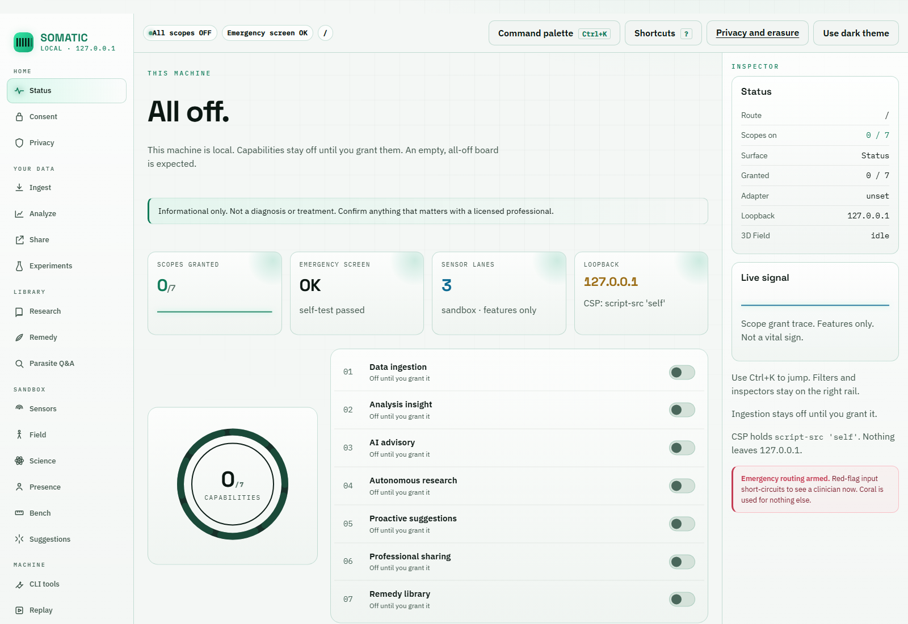

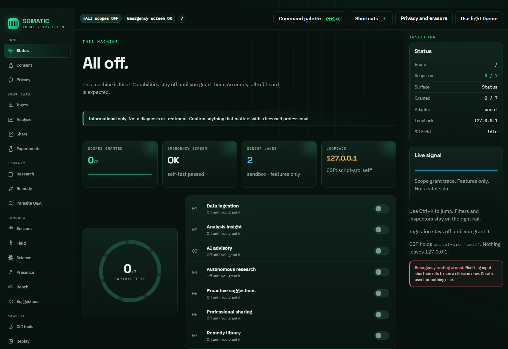

**Local UI — all scopes off:** KPI tiles plus the 7-segment capability ring. Nothing is granted until you say so. Light (top) and dark (bottom, the default theme).

### Command palette

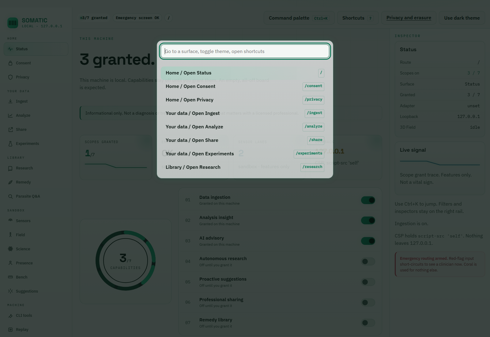

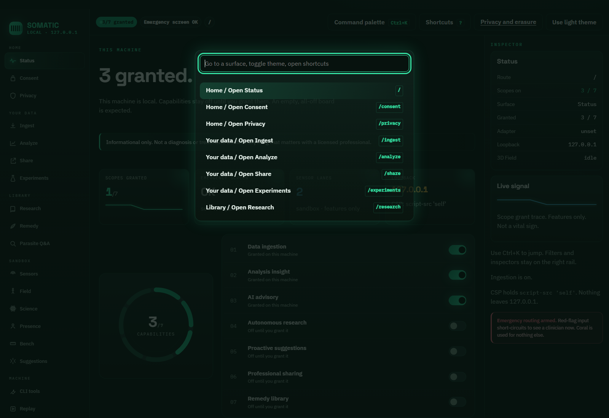

**Local UI — ⌘K / Ctrl+K:** jump to a surface without leaving loopback. Overlay on the Bioluminescence cockpit; not a hosted command bar. Light (top) and dark (bottom). The capture script opens the palette after demo Field/Presence grants, so the background is not the all-off Status board.

### Sensors (live lane access)

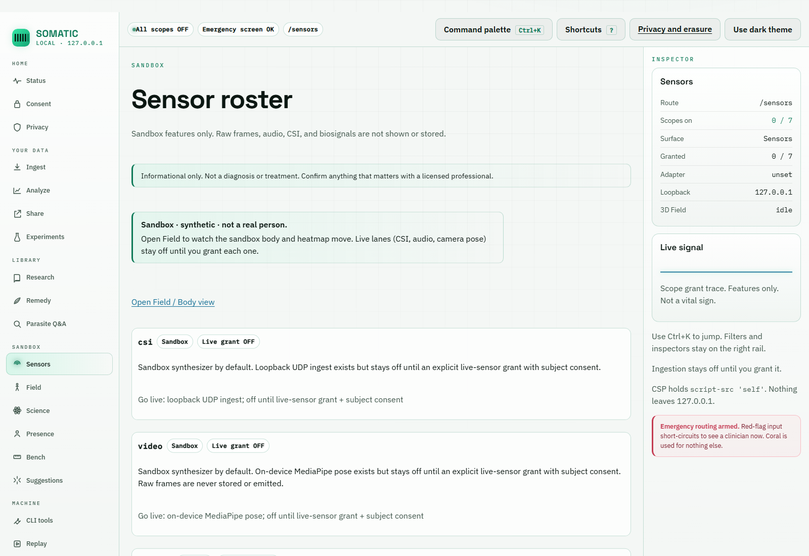

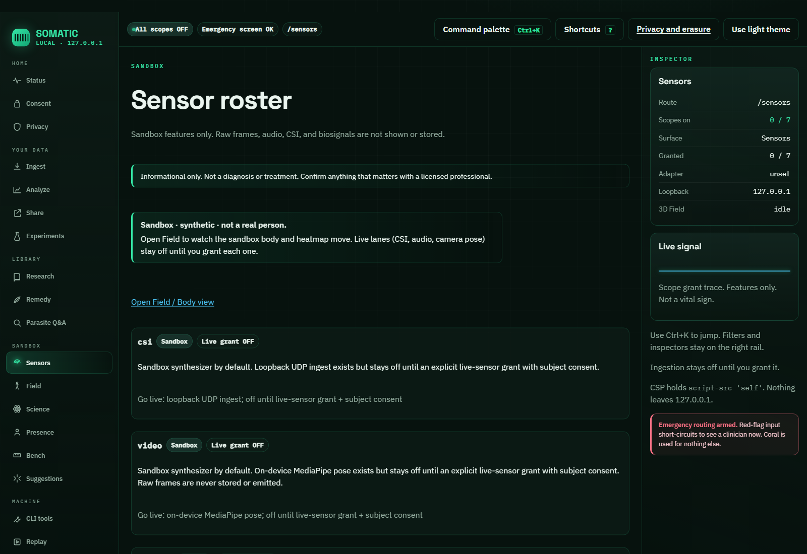

**Local UI — sensor roster:** every lane is sandbox by default. The **Live lane access** panel lists csi / audio / video / video3d grants, each default OFF with its own subject-consent checkbox. Nothing opens hardware until you grant it.

### Field (sandbox / synthetic)

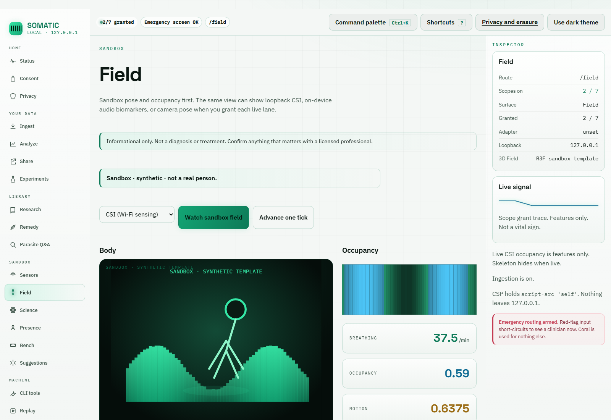


**Local UI — sandbox Field:** synthetic template body and occupancy waterfall, now with the modality selector (CSI / audio / camera pose). **Not a real person.** Capture uses a sandbox preview tick after `data-ingestion` and `analysis-insight` grants; live lanes stay off. Light (top) and dark (bottom).

### Consent

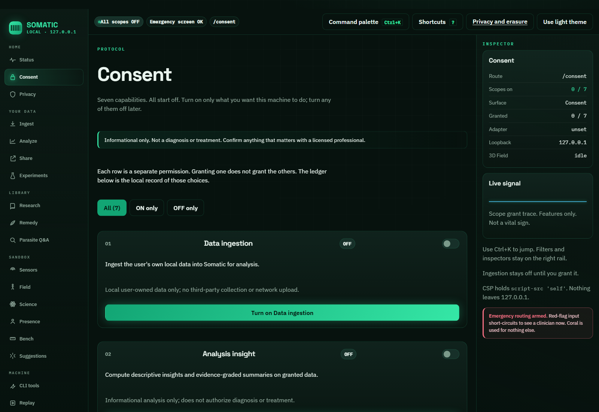

**Local UI — numbered protocol:** scopes `01`–`07`, all default OFF. Grant and revoke write `~/.somatic/consent.json`.

Light and dark captures of every surface: [docs/ui-screenshots/](docs/ui-screenshots/).

## 🧭 Architecture

| Surface | What it owns | First files |
| --- | --- | --- |
| `somatic/consent/` | Seven default-OFF scopes, ledger, JSON store, right-to-erasure | `somatic/consent/scopes.py`, `ledger.py`, `store.py` |
| `somatic/safety/` | Emergency screen, consent gate, advisory framing, evidence grades | `somatic/safety/core.py` |
| `somatic/advisory/` | Optional OpenAI-compatible informational adapter | `somatic/advisory/adapter.py`, `models.py` |
| `somatic/insights/` | Own-baseline / caller-range insights; no hardcoded normals | `somatic/insights/engine.py` |
| `somatic/flows/` | Analyze and share end-to-end flows | `somatic/flows/analyze.py`, `share.py` |
| `somatic/research/` | Offline retrieval, citation-binding, optional live Europe PMC | `somatic/research/loop.py`, `bind.py`, `live.py` |
| `somatic/remedy/` | Evidence-graded informational library | `somatic/remedy/library.py` |
| `somatic/parasite/` | Informational parasite Q&A (not identification) | `somatic/parasite/identify.py` |
| `somatic/ingest/` | CSV / Apple Health import and readings store | `somatic/ingest/csv.py`, `apple_health.py`, `packet.py`, `store.py` |
| `somatic/experiments/` | N-of-1 tags vs own series | `somatic/experiments/n_of_1.py`, `store.py` |
| `somatic/sensors/` | Sandbox roster; guarded live lanes: loopback CSI, on-device audio biomarkers, MediaPipe camera pose (all default-OFF) | `somatic/sensors/roster.py`, `live_csi.py`, `live_audio.py`, `live_video.py`, `field.py` |
| `somatic/local_crypto.py` | Opt-in AES-GCM encryption at rest for local stores; default plaintext + `0600` | `somatic/local_crypto.py` |
| `somatic/evidence_bus/` | Sandbox Evidence Bus adapters and loop | `somatic/evidence_bus/loop.py`, `adapter.py` |
| `somatic/science/` | Sandbox science harness + name-only biosecurity | `somatic/science/harness.py`, `biosecurity.py` |
| `somatic/presence/` | Render-only Scientist/Doctor restatement | `somatic/presence/avatar.py` |
| `somatic/bench/` | Sandbox fixture scoring | `somatic/bench/runner.py` |
| `somatic/bridge/` | Loopback HTTP + JSON API for the local UI | `somatic/bridge/server.py`, `api.py` |
| `somatic/cli/` | `python -m somatic` command surface | `somatic/cli/main.py` |
| `ui/` | Authoring package (Vite + React). Not required at use-time | `ui/README.md`, `ui/src/main.tsx` |
| `somatic/bridge/static/` | Shipped SPA assets under CSP `script-src 'self'` | `somatic/bridge/static/` |

Longer map, including pre-pivot mock-run and Fabric: [docs/ARCHITECTURE.md](docs/ARCHITECTURE.md). Local UI guide: [docs/how-it-works/local-ui.md](docs/how-it-works/local-ui.md).

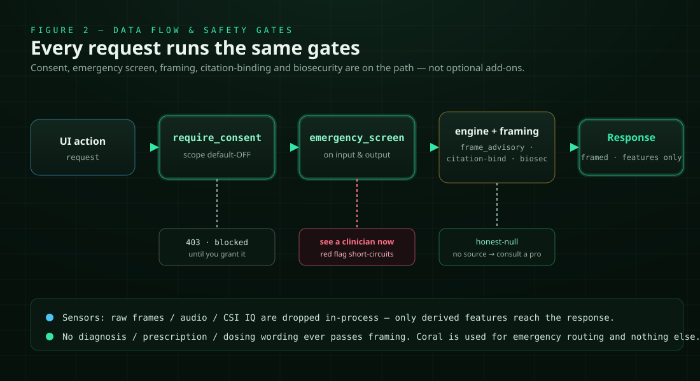

**Figure 2 — Somatic data flow and safety gates:** every privileged API reuses the real engine; the browser never reimplements a gate. Consent off → 403. Red flag → see a clinician now. No bound source → honest-null. Source: [docs/diagrams/somatic-data-flow-gates.svg](docs/diagrams/somatic-data-flow-gates.svg) (authored SVG). Simplified [draw.io](docs/diagrams/somatic-data-flow-gates.drawio) and [Mermaid](docs/diagrams/somatic-data-flow-gates.mmd) alternates.

## 🚀 Quickstart

Python **3.11+**. The core needs only the standard library. Nothing to `pip install` for `ui`, `doctor`, `analyze`, `share`, or `consent`.

```powershell
python -m somatic ui
```

That binds **127.0.0.1:8765** and opens the local app. Use `--no-browser` if you do not want a window; `--port 0` for an ephemeral port. `--host` must be `127.0.0.1` or `localhost`.

Then, from the same checkout:

```powershell
python -m somatic consent status
python -m somatic doctor
python -m somatic analyze --help
python -m somatic share --help
```

`analyze` and `share` require `--data` pointing at a JSON packet of the user's own metrics. They fail closed without the matching consent grant (or a session `--grant` overlay). `--model-key` on the CLI is refused; keys come from the environment only.

## ⚙️ Configuration

Start from [`.env.example`](.env.example). Never commit `.env`, API keys, or model credentials.

Product toggles that actually exist:

| Item | Default | Override |
| --- | --- | --- |
| Consent ledger | `~/.somatic/consent.json` (mode `0600`) | `SOMATIC_CONSENT_PATH` |
| Readings | `~/.somatic/readings.json` | `SOMATIC_INGEST_PATH` |
| Experiment tags | `~/.somatic/experiments.json` | `SOMATIC_EXPERIMENT_PATH` |
| Live literature | **off** | `SOMATIC_RESEARCH_LIVE=1` (or `true` / `yes` / `on`) |
| Encryption at rest | **off** (plaintext + `0600`) | `SOMATIC_ENCRYPT_STORES=1`; key via `SOMATIC_STORE_PASSPHRASE` or per-store `<store>.key`. Needs the optional `cryptography` package (`pip install 'somatic[fabric]'`). See [SECURITY.md](SECURITY.md) |
| Live sensor grants | **off** per modality | Sensors screen or `sensor-roster live-grant --modality {csi,audio,video,video3d} --subject-consent` |
| Learned audio model | off (`openai/whisper-tiny`, offline) | Install `.[audio]` extra; pre-cache the checkpoint; `SOMATIC_AUDIO_MODEL_ENABLED=1`; optional `SOMATIC_AUDIO_MODEL` override |
| Advisory model URL | unset | `SOMATIC_ADVISORY_MODEL_URL` |
| Advisory model name | unset | `SOMATIC_ADVISORY_MODEL` |
| Advisory API key | unset | `SOMATIC_ADVISORY_MODEL_KEY` (env only, never argv) |
| Advisory option id | OpenAI-compatible default | `SOMATIC_ADVISORY_MODEL_OPTION` |
| Advisory timeout | 30 seconds | `SOMATIC_ADVISORY_TIMEOUT_SECONDS` |
| UI bind | `127.0.0.1:8765` | `--port` / `--host` (host must stay loopback) |

`.env.example` also lists Fabric sidecar placeholders from the pre-pivot scaffold. Those are not required to run the local UI.

## 🧪 Development

```powershell
python -m unittest
python -m somatic doctor
python -m ruff check somatic/bridge somatic/net somatic/research tests/test_ui_bridge.py tests/test_ssrf.py tests/test_research_live.py
```

- Authoritative test gate on the host: `python -m unittest`.
- Intended GitHub merge gate: workflow **`CI`**, job **`unittest`** (`python -m unittest`, `python -m somatic doctor`, then a mock `somatic run` of `fixtures/workflows/valid-literature-only.yaml`). Recent PRs have hit Actions `startup_failure` before jobs start; host unittest + doctor remain the corroboration when that happens.
- Ruff on the **changed** Python, per [AGENTS.md](AGENTS.md). The legacy tree is not yet repo-wide clean; do not treat `ruff check .` as a current green bar.
- Optional UI authoring: `cd ui; npm run a11y`. Not required at use-time.
- Operator / planner manuals: [AGENTS.md](AGENTS.md), [CLAUDE.md](CLAUDE.md).
- Phase archive: [docs/HISTORY.md](docs/HISTORY.md).

## 🛡️ Security / Privacy

This is the product, not a footer.

- **Seven default-off consent scopes.** Privileged work fails closed until an explicit grant. `--grant` on CLI is session-only.
- **Local-first loopback.** The UI binds `127.0.0.1`. Non-loopback `Host` / `Origin` is refused.
- **CSP `script-src 'self'`.** No inline scripts, no CDN fonts, no analytics beacons.
- **No raw sensor egress.** Features only. Live capture endpoints are refused. Hardware integration is not implemented.
- **Right-to-erasure.** Consent ledger, readings, and experiment tags are unlinked together. Corrupt JSON fails closed to empty / all-OFF; erase unlinks first so a bad file cannot block deletion.
- **Encryption at rest is opt-in.** Set `SOMATIC_ENCRYPT_STORES=1` to encrypt the local stores (consent ledger, readings, experiment tags, sensor features) with AES-256-GCM from the optional `cryptography` package (`pip install 'somatic[fabric]'`). Key material comes from `SOMATIC_STORE_PASSPHRASE`, or a per-store `0600` key file (`<store>.key`) that Somatic creates beside each store. Undecryptable or corrupt stores fail closed to all-OFF/empty — the same safeguard as corrupt JSON. Erasure deletes both ciphertext and key material. The default stays **plaintext + `0600`**; see [SECURITY.md](SECURITY.md).
- **Informational framing + emergency routing.** No "you have X / take N mg" product copy. Red flags stop the path. Crisis routing defaults to US 988 and switches to locale-appropriate lines where known (Spanish: 988 press 2 / Spain 024; French: France 3114).
- **Citations or honest-null.** Research claims must bind to retrieved passages. The offline corpus is a **fixture**, not a live literature lake.
- **Biosecurity refuse-list** on science paths: public names only. No synthesis, modification, or acquisition instructions.
- **Optional network is narrow.** Live literature: https, host allowlist, no redirects, 256 KiB cap, question string only, SSRF-guarded (`somatic/net/ssrf.py`). Advisory: https or loopback when a key is set; private / link-local / metadata encodings refused.

Honest limitations:

- Stores are **plaintext JSON** with `chmod 0600` **by default**. Stdlib has no AES, so encryption needs the optional `cryptography` package and stays opt-in (`SOMATIC_ENCRYPT_STORES=1`). Until you enable it, anyone with file-system access to `~/.somatic/` can read your stores.
- Emergency and framing lexicons cover **English, Spanish, and French** (NFKC-normalized). Other languages remain a known gap, not a silent pass.
- Default research is an **offline fixture corpus**. Bound claims from that path are extracts of those fixtures.
- `SECURITY.md` is still the older reporting / Phase-0 boundary note. Loopback DAST, SSRF, and closeout evidence live in [planning/FINISHING-REPORT.md](planning/FINISHING-REPORT.md).

Report vulnerabilities per [SECURITY.md](SECURITY.md). Do not attach private health data or exploit payloads to public issues.

## 🛤️ Roadmap

- **Local v1** — this repository: consent spine, safety gates, analyze/share, citation-bound research over the offline corpus, local UI.
- **Optional live literature** — already implemented and **off by default** (`SOMATIC_RESEARCH_LIVE`). Stays consent-gated, question-string-only, CI-offline. Not a claim that CI or default runs hit PubMed.
- **Live sensor hardware** — founder-gated. Not implemented (`LIVE_SENSOR_INTEGRATION_IMPLEMENTED = False`).
- **Mobile / adaptive UI** — deferred.
- **LICENSE / public release / website** — founder-gated. This README does not publish a product URL.

Queue: [planning/backlog.md](planning/backlog.md). Closeout evidence: [planning/FINISHING-REPORT.md](planning/FINISHING-REPORT.md).

## 📜 License

No `LICENSE` file exists at repository root. Treat this repository as **all rights reserved** until the founder adopts an explicit license.

See [LICENSE-DISCUSSION.md](LICENSE-DISCUSSION.md). This README does not pick one.
