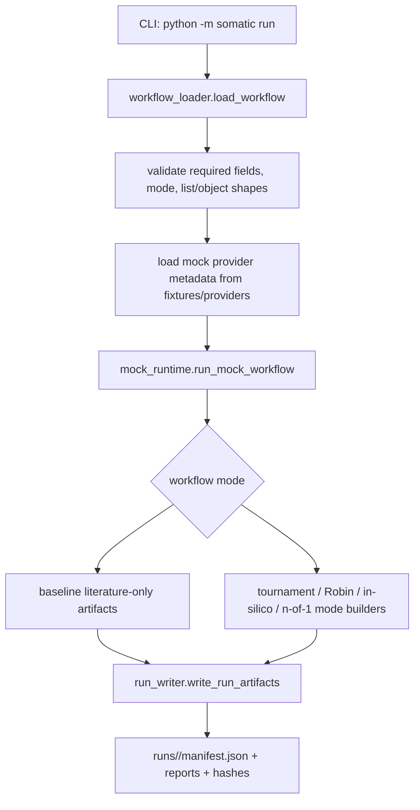
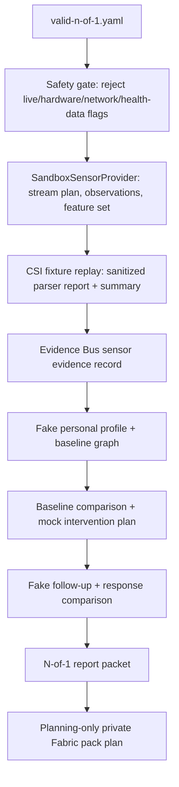
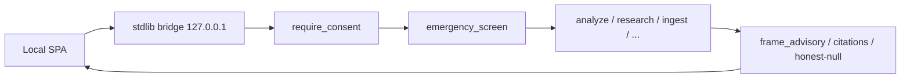
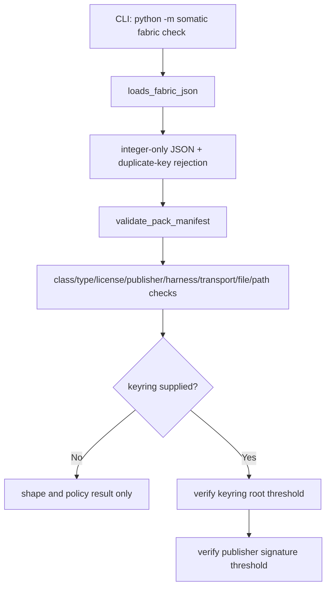

# Somatic Architecture

The live product is a consent-gated, local-first, informational personal-health engine. The package map, Figure 1, and Figure 2 live on the [README](../README.md). Committed drawings:

- [docs/diagrams/somatic-local-architecture.svg](diagrams/somatic-local-architecture.svg) ([draw.io](diagrams/somatic-local-architecture.drawio), [Mermaid](diagrams/somatic-local-architecture.mmd))
- [docs/diagrams/somatic-data-flow-gates.svg](diagrams/somatic-data-flow-gates.svg) ([draw.io](diagrams/somatic-data-flow-gates.drawio), [Mermaid](diagrams/somatic-data-flow-gates.mmd))

Quiet Instrument identity: moss `#1B6B45`, ink `#14261F`, paper `#FFFFFF`. Not neon.

The sections below still document the older mock-run / Fabric / Phase 11–12 scaffold that remains in the CLI (`python -m somatic run`, `fabric`, planning contracts). That scaffold is real code. It is not the product pitch.

---

Somatic is a standalone, offline-first scientific discovery scaffold. It maps future literature, hypothesis, simulation, sensor, lab, Fabric, and reporting workflows into explicit contracts before any real provider runtime is authorized.

The current codebase is intentionally conservative: the runnable paths use local fixtures, Python's standard library, deterministic mock data, and public status surfaces that keep real-mode execution blocked.

## Major Areas

| Area | What It Owns |
| --- | --- |
| `somatic/consent/` | Granular consent scopes (all default OFF), local ledger, JSON store, right-to-erasure. |
| `somatic/safety/core.py` | Emergency screen, `require_consent`, `frame_advisory`, evidence grades. |
| `somatic/advisory/` | OpenAI-compatible informational AI adapter (consent + emergency + framing gated). |
| `somatic/insights/` | Own-baseline / caller-supplied reference grading. No hardcoded medical normals. |
| `somatic/flows/` | `analyze` and `share` end-to-end CLI flows. |
| `somatic/cli/` | The `python -m somatic` command surface: mock runs, doctor status, **local UI** (`ui`), analyze/share/consent, ingest/experiment/research, Evidence Bus / sensor-roster / science / avatar / bench-run / evidence-verify, replay inspection, CSI parsing, sensor-evidence inspection, and Fabric fixture checks. |
| `somatic/bridge/` | Stdlib loopback HTTP + JSON API for the local UI. Reuses engine functions; binds 127.0.0.1 only. |
| `somatic/workflow_loader.py` and `somatic/contracts.py` | The small workflow fixture contract: supported modes, required fields, simple YAML parsing, provider fixture lookup, and sensor-evidence config validation. |
| `somatic/mock_runtime.py` | The local mode router. It assembles deterministic artifacts for literature-only, tournament, Robin, in-silico, n-of-1, and related fixture workflows. |
| `somatic/run_writer.py` | The run directory writer. It creates `runs/<run-id>/`, writes artifacts, computes SHA-256 hashes, and emits `manifest.json`. |
| `somatic/agents/` | Deterministic Crow/Falcon/Finch/tournament/team-orchestrator scaffolds. These are mock reasoning shapes, not live model agents. |
| `somatic/analysis/` | Standard-library table, statistics, dose-response, provenance, and disabled optional-extras metadata for Finch-style analysis. |
| `somatic/evidence/` and `somatic/evidence_bus/` | Sanitized evidence contracts, document fixture adapters, EvidenceSource/RawEvidence/StructuredVerdict shapes, sandbox Evidence Bus adapters for every modality, and no-raw-body evidence-pack boundaries. |
| `somatic/sensors/` | Sandbox sensors, WiFi CSI fixture parsing/replay/scoring, environment and toy-counter evidence packs, the sensor-evidence provider registry, the sandbox sensor roster / RF↔vision fusion node, Field snapshots, loopback CSI ingest (off until live grant; hardware validation of a physical ESP32 is not claimed), and on-device camera pose via MediaPipe in the optional `video` extra (features only; raw frames never stored or emitted). |
| `somatic/science/` | Sandbox autonomous-science harness: tournament + teams + Evidence Bus + stdlib Beta belief + falsifier + name-only biosecurity refuse-list. |
| `somatic/presence/` | Render-only Scientist/Doctor restatement over a gated verdict. TTS, talking-head, camera, and microphone stay disabled. |
| `somatic/bench/` | Sandbox `somatic-bench` runner for the ripasudil/dAMD fixture task. No lab spend. |
| `somatic/provenance/` | Content-addressed SHA-256 verify. P2P distribution stays disabled. |
| `somatic/memory/` and `somatic/reports/` | Fake-backed n-of-1 profile, baseline, intervention, response-evaluation, report-packet, and private Fabric pack-plan scaffolds. |
| `somatic/providers/` | Disabled or fake-backed provider adapters for literature, Robin, PaperQA2, scientific-agent-skills, AutoScientists mapping, Boltz, biomodels, sensors, and team orchestration. |
| `somatic/safety/` | Real-mode readiness gates, biomodel safety gates, and Phase 11/12 metadata-only planning contracts. Public outputs never authorize runtime execution. |
| `somatic/fabric/` | Local Content Fabric manifest, canonical JSON, digest, signature, keyring, catalog, path, conformance, and interop fixture helpers. No pack install or execution runtime exists. |
| `fixtures/` | Offline JSON/YAML/CSV fixtures used by local runs and tests. These are the source of truth for mock providers, workflows, Fabric vectors, reviews, sensors, and reports. |
| `tests/` | Standard-library `unittest` coverage for CLI behavior, contracts, fixtures, safety boundaries, Fabric checks, and workflow artifacts. |
| `ui/` | Vite + React authoring package. Not a Python dependency. Production UI is `somatic/bridge/static/`. |
| `docs/` | Human contracts and phase notes. This file is the high-level map; `docs/how-it-works/` holds shorter subsystem guides. |

The `packages/` folders are placeholder package-boundary READMEs for a future split. The live Python package is `somatic/`.

## Core Request Flow: Local Mock Run

Important files:

- `somatic/cli/main.py`: argument parsing and public commands.
- `somatic/workflow_loader.py`: fixture YAML parsing and validation.
- `somatic/mock_runtime.py`: mode dispatch and artifact payload construction.
- `somatic/run_writer.py`: durable run directory layout and hash manifest.

This path is mock/offline. It does not call provider APIs, install packages, access sensors, perform lab actions, download models, or authorize runtime execution.

## Core Data Flow: N-of-1 Sensor Planning

The n-of-1 flow is the densest path in the repo. Start at `_run_n_of_1` in `somatic/mock_runtime.py`, but read it in phases: observation, CSI metadata, baseline, intervention, follow-up, packet, Fabric plan. The report packet schema is in `somatic/reports/n_of_1_packet.py`.

## Local graphical UI

The shipped UI is a Vite-built React SPA in `somatic/bridge/static/`. `python -m somatic ui` starts a stdlib `http.server` on **127.0.0.1** and serves those assets. JSON routes in `somatic/bridge/api.py` call the same engine functions as the CLI. Consent, emergency screening, advisory framing, citation-binding, and biosecurity refusals stay in Python.

Committed drawings: [docs/diagrams/somatic-local-architecture.svg](diagrams/somatic-local-architecture.svg) ([draw.io](diagrams/somatic-local-architecture.drawio), [Mermaid](diagrams/somatic-local-architecture.mmd)) and [docs/diagrams/somatic-data-flow-gates.svg](diagrams/somatic-data-flow-gates.svg) ([draw.io](diagrams/somatic-data-flow-gates.drawio), [Mermaid](diagrams/somatic-data-flow-gates.mmd)). Guide: [docs/how-it-works/local-ui.md](how-it-works/local-ui.md).

The `ui/` Vite + React package is authoring-only. Production ships a CSP-clean IIFE (`script-src 'self'`), not Next hydration.

## Core Data Flow: Content Fabric Fixture Check

Fabric starts with metadata and fixtures, not installation. The live scope is deterministic validation, canonical bytes, digest/signing payload helpers, test keyrings, signed catalogs, and shared interop fixtures. BitTorrent/WebSeed runtime, pack download, install/quarantine, plugin enablement, sandbox execution, and production signing are still future work.

## Safety Invariant

The public safety invariant is simple: reviewed is not authorized.

`somatic/safety/adapter_readiness.py` can record satisfied review gates, but it still returns `execution_permitted: false`, `runtime_stage: not-implemented`, and `real_mode_runtime_enabled: false`. Phase 11 and Phase 12 contracts under `somatic/safety/` are metadata-only planning surfaces. They must not be described as runtime-ready.

## Where To Read Next

- New contributor path: `docs/ONBOARDING.md`.
- Area guides: `docs/how-it-works/`.
- CLI details: `docs/cli.md`.
- Workflow schema: `docs/workflow-schema.md`.
- Safety boundaries: `docs/safety-boundaries.md`.
- Content Fabric rules: `docs/content-fabric.md`.
- Large historical map: `docs/source-map.md`.
